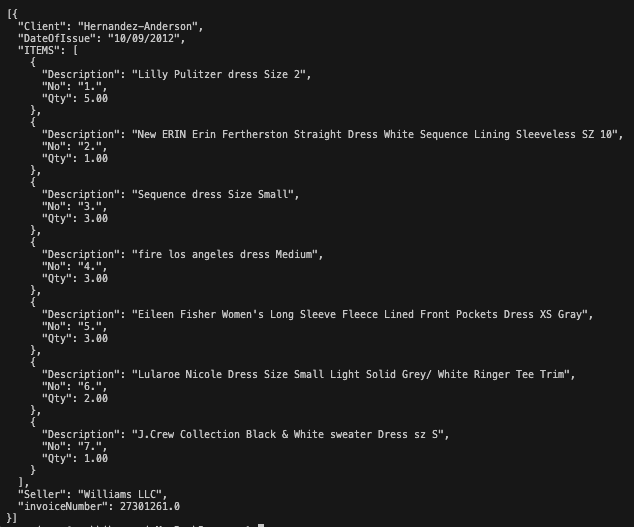

### 권석기 ###

1차 과제

# 2번 과제

## 요구사항

- 과제 목표: Gemini API의 File API와 Structured Output 기능을 활용하여 PDF 문서에서 특정 데이터를 추출하고 Pydantic 모델로 구조화하는 방법을 이해하고 실습할 수 있습니다.
- 요구 사항:
    - Gemini API의 File API를 이용하여 PDF 파일을 업로드하고, Pydantic 모델을 정의하여 해당 PDF 파일에서 원하는 데이터를 정형화된 형태로 추출하는 코드를 작성합니다.
    - 샘플 PDF 파일(invoice.pdf, handwriting_form.pdf) 또는 개인적으로 준비한 PDF 파일을 사용해도 좋습니다.
    - 모델은 Gemini 2.5 Flash를 이용합니다.
- 최종 결과물: 작성된 결과물을 Pull Request로 올려주세요.

## 1. Node 환경에서 Gemini API 연동

https://ai.google.dev/gemini-api/docs/quickstart?hl=ko&lang=node 해당 문서를 참고하여 초기설정 했습니다.

```javascript
import 'dotenv/config';
import {
  GoogleGenAI,
  createUserContent,
  createPartFromUri,
  Type,
} from "@google/genai";

const ai = new GoogleGenAI({ apiKey: process.env.API_KEY });

async function main() {
  const myfile = await ai.files.upload({
    file: __dirname + "/invoice.pdf",
    config: { mimeType: "application/pdf" },
  });

  const response = await ai.models.generateContent({
    model: "gemini-2.5-flash-preview-04-17",
    contents: createUserContent([
      createPartFromUri(myfile.uri!, myfile.mimeType!),
      "Describe this audio clip",
    ])
    });
  console.log(response.text);
}
```
gemini-2.0-flash는 pdf파일 업로드를 지원하지 않더라구요 model 속성에 정확히 모델명 gemini-2.5-flash-preview-04-17을 입력해줘야 했습니다.
그리고 업로드할때 정확한 파일의 경로와 mimeType을 설정해줘야 합니다.

## 2. Schema를 정의하고 구조화된 데이터 출력

실제 프로젝트를 진행할때 ai를 활용해본적이 없다보니 어떻게 일관된 구조를 클라이언트에서 받아볼 수 있을까 막연한 궁금증만 있었습니다. [Gemini API로 구조화된 출력 생성](https://ai.google.dev/gemini-api/docs/structured-output?lang=node&hl=ko) 문서에서는 프롬프트에 스키마를 텍스트로 제공 또는 모델 구성을 통해 스키마를 제공하는 2가지 방법을 제안합니다.

문서에서는 스키마를 프롬프트애 의존하는 것보다 이 방식이 더 정확하게 제어할 수 있다고 합니다. 저는 예제파일에 있는 invoice.pdf 파일을 업로드하고 간단한 정보와 테이블 데이터를 구조화하여 출력해 봤습니다.

```javascript
config: {
      responseMimeType: 'application/json',
      responseSchema: {
        type: Type.ARRAY,
        items: {
          type: Type.OBJECT,
          properties: {
            'invoiceNumber': {
              type: Type.NUMBER,
              description: 'invoice number',
              nullable: false
            },
            'DateOfIssue': {
              type: Type.STRING,
              description: 'Date of issue',
              nullable: false
            },
            'Seller': {
              type: Type.STRING,
              description: 'Seller',
              nullable: false
            },
            'Client': {
              type: Type.STRING,
              description: 'Client',
              nullable: false
            },
            'ITEMS': {
              type: Type.ARRAY,
              description: 'ITEMS',
              nullable: false,
              items: {
                type: Type.OBJECT,
                properties: {
                  'No': {
                    type: Type.STRING,
                    description: 'Serial number present in table header',
                    nullable: false
                  },
                  'Description': {
                    type: Type.STRING,
                    description: 'Serial number present in table header',
                    nullable: false
                  },
                  'Qty': {
                    type: Type.NUMBER,
                    description: 'Serial number present in table header',
                    nullable: false
                  },
                }
              }
            },
          },
          required: ['invoiceNumber', "DateOfIssue", "Seller", "Client", "ITEMS"]
        }
      }
    }
```

Schema 작성할떄 조금 헤맸는데 데이터 타입이 array인 경우 items object 인경우 properties를 반드시 설정해야 합니다.

## 출력


